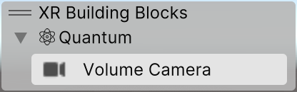

# Developing for PolySpatial XR
This section covers several workflow additions to the Unity engine that will let you seamlessly create builds for PolySpatial XR.

Here, you will find more info about the building blocks available in PolySpatial XR, a short description of workflows in dependency packages with links to said packages (XRI / ARF), information about how input works in PolySpatial XR, guidance for optimizing PolySpatial XR performance, and other deep topics specific to PolySpatial XR.

## Building Blocks in PolySpatial XR
The building blocks system is an overlay window in the scene view that can help you quickly access commonly used items in your project. To open the building blocks overlay click on the hamburger menu on the scene view &gt; Overlay menu Or move the mouse over the scene view and press the "tilde" key. Afterwards just enable the Building Blocks overlay.

You can find more info about the building blocks system in the [XR Core utils package](https://docs.unity3d.com/Packages/com.unity.xr.core-utils@latest).

Building blocks available in PolySpatial XR:

| **Building block** | **Description**                                                                                                                                          |
|--------------------|----------------------------------------------------------------------------------------------------------------------------------------------------------|
| **Volume Camera**  | Creates an empty game object with a [Volume Camera](PolySpatialXRComponentReferenceGuide.md#volume-camera-volumecamera) component attached to it. |

## Package dependencies

## Performance optimization on PolySpatial XR

