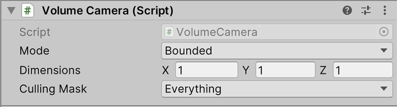

# PolySpatial Component Reference Guide
This section covers all the components available to develop projects for PolySpatial XR. This is not to be confused with the API reference which is accessible from the Scripting API reference, but instead an explanation of each component and component member descriptions.

## Volume Camera (`VolumeCamera`)

With `Mode` set to `Bounded`, a volume camera captures content within an oriented bounding box (OBB) and transforms this content to a "canonical volume," similar to the canonical view volume of a regular camera: a unit box centered at the origin.

Typically, this content is then displayed on a host platform by a corresponding "volume renderer", by mapping this canonical volume out to the host volume renderer's own distinct OBB. The effect is that 3D content within the volume camera's bounds is transformed, rotated, stretched and/or squashed to fill the volume renderer's bounds.

 When `Mode` is set to `Unbounded`, everything works similar to a typical Unity camera, except that the volume camera and volume renderer each define an unbounded 3-space rather than a bounded 3-space volume.

| **Member**       | **Description**                                                                                                                                                  |
|------------------|------------------------------------------------------------------------------------------------------------------------------------------------------------------|
| **Mode**         | Sets bounding behavior of the volume: **Bounded** restricts the rendered content to the oriented bounding box (OBB); **Unbounded** (no OBB is used); or **Invalid** |
| **Dimensions**   | Sets the size of the oriented bounding box dimensions in X, Y, Z.                                                                                                |
| **Culling Mask** | Refers to the culling mask of the Volume camera; used to render parts of the Scene selectively.                                                                  |
