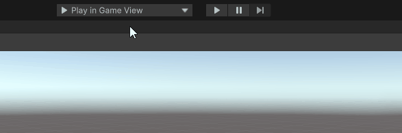

# PolySpatial XR Simulation
Testing your Unity project and iterating quickly is one of the most important elements of app development, and authoring projects for Unity PolySpatial XR is no exception.

This section covers the new *Play-To* menu dropdown available for PolySpatial XR that lets you select where your project will be deployed for testing and all the available options one has at hand for quickly testing new features added to your project.

## The PlayTo Menu

Developing XR projects can be highly impacted by the device targeted by the application and using the Game View to test the current content is not always the best approach.
In some situations one might want to use a XR device simulator or test using a Live-Link connection to the device. The new **PlayTo** menu addresses this need.

Given on your current project setup, plugins and connected devices; the **PlayTo** menu will display different alternatives you have to run your content.
In the dropdown menu you can select the option you prefer and then enter into playmode by pressing the Play button.
Depending on the selected option the application will run in the Game View, a Simulation Window or directly on the device with no extra steps needed.



It is also possible to add your custom PlayTo options to that menu, To do so; create a class inheriting from `UnityEditor.PlayToModeMenu.IPlayToModeMenuItem`.

As an example:
```
using UnityEditor;
using UnityEngine;
public class MyCustomPlaymodeMenuItem : PlayToModeMenu.IPlayToModeMenuItem
{
    public string MenuEntry => "Custom Items/My Simulator";
    public int Priority => 50;
    Texture2D m_Icon;
    public Texture2D icon
    {
        get
        {
            if (m_Icon == null)
                m_Icon = Resources.Load<Texture2D>("myIcon");
            return m_Icon;
        }
    }
    public bool IsAvailable() => true;
    
    public void InvokeOnPlayModeEnter()
    {
        //Insert here your custom action to call when entering playmode
        Debug.Log("Invoke PlayModeEnter (MyCustomPlaymodeMenuItem)");
    }
    
    public void InvokeOnPlayModeExit()
    {
        //Insert here your custom action to call when exiting playmode
        Debug.Log("Invoke PlayModeExit (MyCustomPlaymodeMenuItem)");
    }
}
```

## Simulating your project