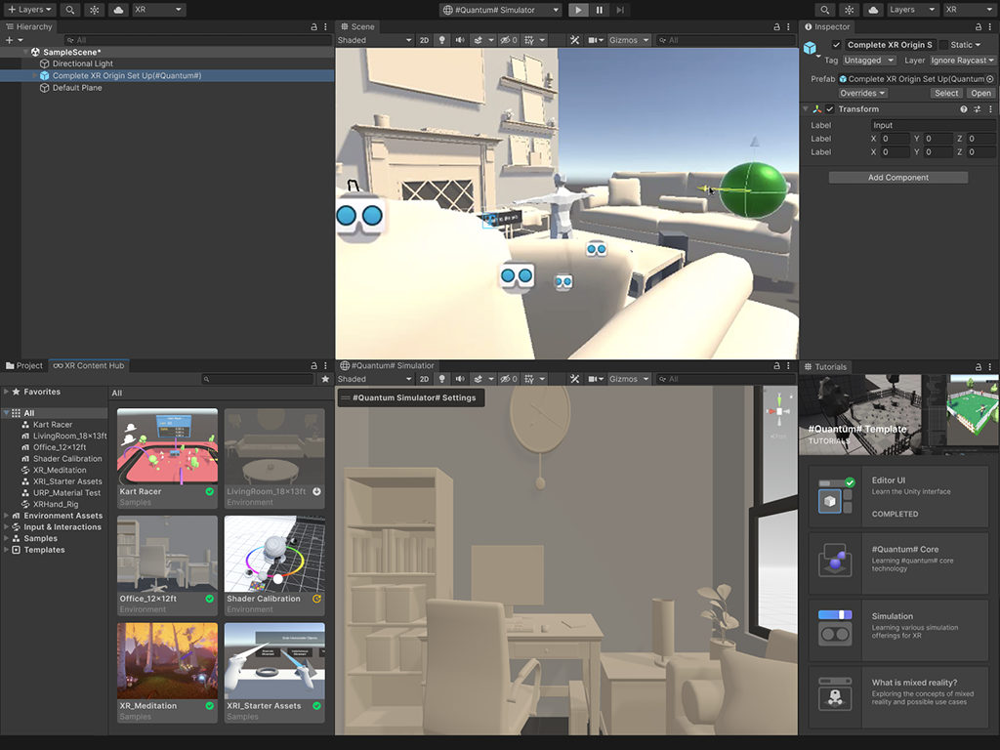

## Introduction

New mixed reality devices entering the market will enable multi-tasking experiences seamlessly integrated into users' homes. These devices open up a new world of possibilities around personal productivity, lifestyle and entertainment applications and a whole new market for developers. However, these new devices and shared world applications will come with new restrictions and limitations for applications where not always you can execute your logic in the device itself.

Building for the PolySpatial XR platform in Unity adds new functionality to support XR content creation that runs on separate devices; this package allows one to decouple different parts of an XR application so the core and rendering parts can easily be split to reduce the computational cost on the targeted device and focus its performance on a better rendering leaving the core application to be processed somewhere else.

One could think about the PolySpatial XR platform as a scenegraph-oriented graphics API that is pupeteered by Unity running on a foreign device.

Developing in Unity for the PolySpatial XR platform solves the underlying complexity of executing and drawing logic on separate devices and offers you a seamless Unity development experience. Most importantly, Unity for PolySpatial XR reacts to real-world and other AR content by default like any other XR Unity app. 

Reality is your build target; think big, design to match and start making content to change the world!

The [Getting Started](GettingStarted.md) page is the ideal landing place for new users: it presents the workflow and information to [build your first app for the visionOS platform](BuildingToVisionOSDevices.md), provides information about example projects and templates, and presents an overview of development best practices for the visionOS platform.

In the [Building to visionOS devices](BuildingToVisionOSDevices.md) section, you will find a step-by-step tutorial that guides you through the complete workflow for installing, setting up and deploying a simple Unity app to a PolySpatial XR device.

This documentation offers several in-depth guides for each section:

* [Developing in the PolySpatial XR platform](DevelopingForPolySpatialXR.md) - Covers several sections important when developing for PolySpatial XR like information about workflows, dependency packages, how to handle input on the PolySpatial XR platform, and more.

* [PolySpatial XR Project Validation](PolySpatialXRProjectValidation.md) - Overview of the project validation system for the PolySpatial XR platform which offers helpful assistance on what is supported and unsupported when developing Unity apps in PolySpatial XR.

* [Simulating your project](PolySpatialXRSimulation.md) - Guide that presents different ways for quickly simulating your Unity PolySpatial XR project before deploying your final app.

* [PolySpatial XR Component Reference Guide](PolySpatialXRComponentReferenceGuide.md) - Overview of every component available when developing for the PolySpatial XR platform.

The [FAQ](FAQ.md) presents answers to many common questions about design, implementation, and use of the PolySpatial XR package.

To quickly understand the terminology used across this documentation, see the [Glossary](Glossary.md) for definitions of common keywords.

## Requirements
Unity PolySpatial XR runs on a special version of the 2022.2 Unity Engine.

## Known Limitations
Currently Unity PolySpatial XR is shipped as an alpha product. Be mindful that since this is an early release, documentation, workflows, and especially API changes will occur, so plan PolySpatial XR projects keeping this in mind.